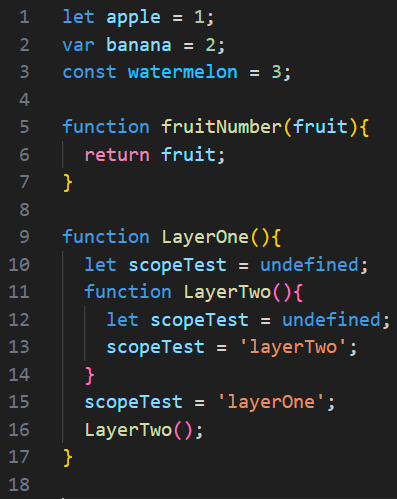
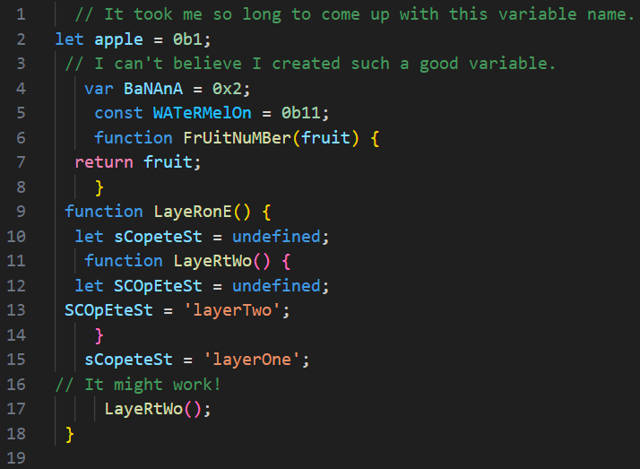

## Unprettier

  </img>
  </img>

 

**Other languages: [Chinese](README_zh.md)**

### About Unprettier
I have used several code beautification tools like Prettier while programming. However, it's rare to come across a tool for code deterioration. 

I built this program after referring to another project([Shittier](https://github.com/rohitdhas/shittier)).

Unprettier is a code formatting tool that provides terrible code formatting. It cound generate awful code that is unreadable, incomprehensible and illogical. 

With this tool, you may expect the following:
- Mixed case for each identifier (scope-based).
- Random indentation for each line.
- Random number system (Binary, Octal and Hexadecimal)
- Weird comments were randomly added (With different comment type).

  

    
    
Before

  

  

    
    
After

  

### Notes
Unprettier **only support js files** currently. The support for other languages will be available in the future (probably)

### Disclaimer

Unprettier is a purely entertaining project. It is highly **unrecommended** to use it in development environment. Using Unprettier on production code may result in frustration, unreadability and decline in code execution efficiency.