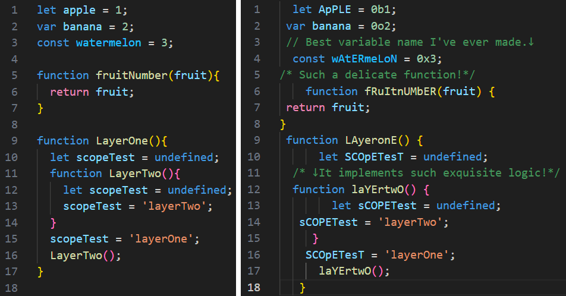

## Unprettier
<div style="display:flex">
  </img>
  </img>
</div>

</br>

**Other languages: [Chinese](README_zh.md)**


### About Unprettier
I have used several code beautification tools like Prettier while programming. However, it's rare to come across a tool for code deterioration. 

I built this program after referring to another project([Shittier](https://github.com/rohitdhas/shittier)).

Unprettier is a code formatting tool that provides terrible code formatting. It cound generate awful code that is unreadable, incomprehensible and illogical. 

With this tool, you may expect the following:
- Mixed case for each identifier (scope-based).
- Random indentation for each line.
- Random number system (Binary, Octal and Hexadecimal)
- Weird comments were randomly added (With different comment type).

### Effect


### Notes
Currently, Unprettier only has full support for javascript files. The full support for other languages will be available in the future (probably).

Only random indentations will be implemented for other file.

### Installation
To install Unprettier, follow these steps:
1. Make sure you have **Node.js** installed on your machine.
2. Open a terminal and run the following command:
   ```shell
   npm install unprettier
   ```
   If you would like to add the package globally, use the code below instead.(You don't have to do this..)
   ```shell
   npm install -g unprettier
   ```

### Usage
After installing Unprettier, you can format your code use the command showing below.
```
unprettier <options> [input] [output]
```

### Options
- `-h, --help`: Displays help information.
- `-f, --force`: Irreversibly overwrite the output file even it exists.

### Example
- Format a file named temp.js in the current directory:
  ```
  unprettier temp.js changed_temp.js
  ```

### Expectations
- Support for more languages
- Batch conversion by folder name

### Disclaimer
Unprettier is a purely entertaining project. It is highly **unrecommended** to use it in development environment. Using Unprettier on production code may result in frustration, unreadability and decline in code execution efficiency.